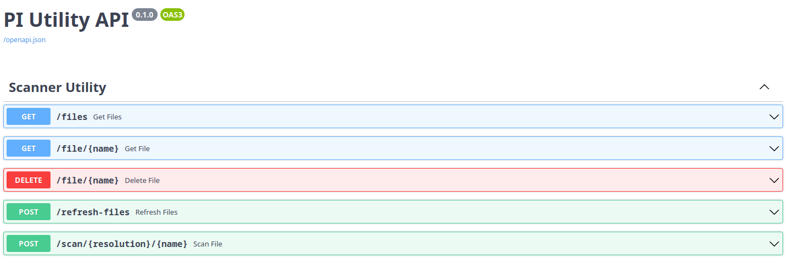

# PI 

The purpose of this respository is to host the various applications, scripts, and configurations I implement for my rasberry PI 4.

The PI, is running Ubuntu server and is sequestered on my desk hooked up to an old Canon Pixma scanner/printer/fax I refuse to throw out. The PI serves as a local network proxy to the printer/scanner so that users on my home network can have an easy to use interface to print, scan and browse scanned files.  By nature the PI will also serve as a local file server through FAST API and samba where local machines mount a network drive provided by the PI.

## Server

The PI hosts a FastAPI/Uvicorn API and File server that facilitaties the interaction to the scannner and in the future, the printer.  The api can be used via the openapi docs that FastAPI autogenerates or by the custom website that is a WIP.

